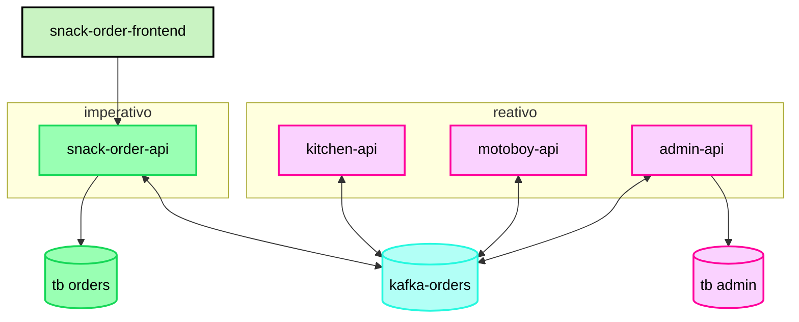
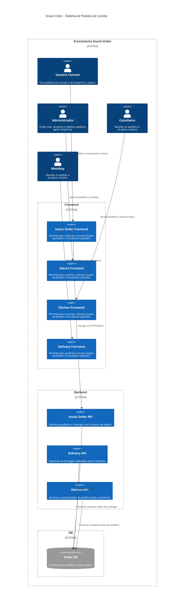

## SNACK-ORDER-API

 

```mermaid
flowchart TD;
    A[snack-order-frontend]
    B[snack-order-api]
    C[(tb orders)]
    D[(kafka-orders)]
    E[kitchen-api]
    F[motoboy-api]
    G[admin-api]
    H[(tb admin)]

    A --> B 
    B --> C
    B <--> D
    E <--> D
    F <--> D
    G <--> D
    G --> H


    subgraph imperativo
        B
    end
    subgraph reativo
        E
        F
        G
    end
    
    style A fill:#c9f3c2,stroke:#000000,stroke-width:2px,color:#000
    style B fill:#99ffb3,stroke:#16d758,stroke-width:2px,color:#000
    style C fill:#99ffb3,stroke:#16d758,stroke-width:2px,color:#000
    style D fill:#b2fff6,stroke:#26f8df,stroke-width:2px,color:#000
    style E fill:#fad2ff,stroke:#ff009b,stroke-width:2px,color:#000
    style F fill:#fad2ff,stroke:#ff009b,stroke-width:2px,color:#000
    style G fill:#fad2ff,stroke:#ff009b,stroke-width:2px,color:#000
    style H fill:#fad2ff,stroke:#ff009b,stroke-width:2px,color:#000
```

```mermaid
---
config:
  theme: mc
---
C4Context
      title Snack Order - Sistema de Pedidos de Comida
      System_Boundary(b0, "Ecossistema Snack-Order") {
        Person(usuarioComum, "Usuário Comum", "Faz pedidos de comida e acompanha o status.")
        Person(admin, "Administrador", "Pode criar, atualizar e deletar pedidos, <br> gerar relatórios")
        Person(cozinheiro, "Cozinheiro", "Recebe os pedidos e<br> atualiza o status")
        Person(motoboy, "Motoboy", "Recebe os pedido e<br> atualiza o status.")

        System_Boundary(b1, "Frontend") {
            System(snack-order-frontend, "Snack Order Frontend", "Permite que usuários comuns façam, <br>atualizem e visualizem pedidos.")
            System(admin-frontend, "Admin Frontend", "Permite que usuários comuns façam, <br>atualizem e visualizem pedidos.")
            System(kitchen-frontend, "Kitchen Frontend", "Permite que usuários comuns façam, <br>atualizem e visualizem pedidos.")
            System(delivery-frontend, "Delivery Frontend", "Permite que usuários comuns façam, <br>atualizem e visualizem pedidos.")
            
        }

        System_Boundary(b2, "Backend") {
            System(snack-order-api, "Snack Order API", "Gerencia pedidos e interage com o banco de dados.")
            System(snack-order-delivery, "Delivery API", "Gerencia as entregas realizadas pelo motoboy.")
            System(snack-order-kitchen, "Kitchen API", "Gerencia a preparação de pedidos pelo cozinheiro.")
        }

        System_Boundary(b3, "DB") {
            SystemDb_Ext(banco, "Order DB", "Armazena os pedidos e seus status.")
        }
        
      }

      Rel(usuarioComum, snack-order-frontend, "Faz pedidos e acompanha o status")
      Rel(admin, admin-frontend, "Gerencia pedidos e usuários")
      Rel(cozinheiro, kitchen-frontend, "Recebe pedidos e atualiza status")
      Rel(motoboy, delivery-frontend, "Recebe entregas e atualiza status")

      Rel(snack-order-frontend, snack-order-api, "Interage via HTTPS/JSON")
      Rel(snack-order-api, banco, "Persiste pedidos")
      Rel(snack-order-kitchen, banco, "Consulta e atualiza status dos pedidos")
      Rel(snack-order-delivery, banco, "Consulta e atualiza status das entregas")

      UpdateLayoutConfig($c4ShapeInRow="4", $c4BoundaryInRow="1")


```