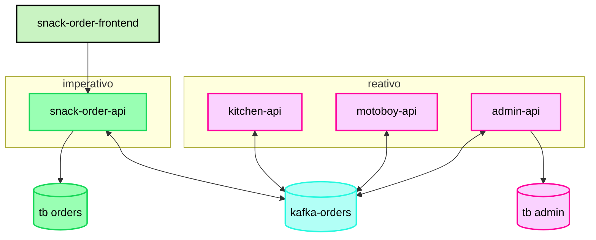

## SNACK-ORDER-API

```mermaid
flowchart TD;
    A[snack-order-frontend]
    B[snack-order-api]
    C[(tb orders)]
    D[(kafka-orders)]
    E[kitchen-api]
    F[motoboy-api]
    G[admin-api]
    H[(tb admin)]

    A --> B 
    B --> C
    B <--> D
    E <--> D
    F <--> D
    G <--> D
    G --> H


    subgraph imperativo
        B
    end
    subgraph reativo
        E
        F
        G
    end
    
    style A fill:#c9f3c2,stroke:#000000,stroke-width:2px,color:#000
    style B fill:#99ffb3,stroke:#16d758,stroke-width:2px,color:#000
    style C fill:#99ffb3,stroke:#16d758,stroke-width:2px,color:#000
    style D fill:#b2fff6,stroke:#26f8df,stroke-width:2px,color:#000
    style E fill:#fad2ff,stroke:#ff009b,stroke-width:2px,color:#000
    style F fill:#fad2ff,stroke:#ff009b,stroke-width:2px,color:#000
    style G fill:#fad2ff,stroke:#ff009b,stroke-width:2px,color:#000
    style H fill:#fad2ff,stroke:#ff009b,stroke-width:2px,color:#000
```